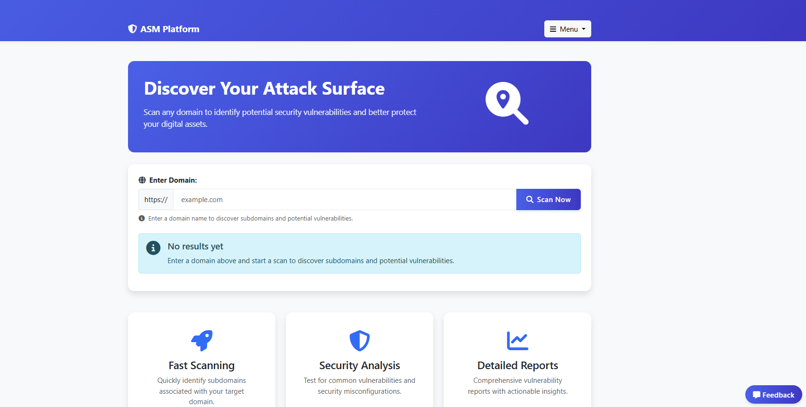

# Attack Surface Management (ASM) Platform

<div align="center">
  
  
  
  
</div>

> **⚠️ DISCLAIMER:** This is a college project built for educational purposes and is not intended for production use. The application may have security vulnerabilities, performance limitations, and lacks many features needed for a production-grade tool.

## 📝 Overview

ASM (Attack Surface Management) is a Django-based web application designed to help identify and visualize the digital attack surface of an organization by discovering subdomains and scanning for common security vulnerabilities. This project was created to demonstrate practical web application development skills while exploring basic cybersecurity concepts.



## ✨ Features

- 🌐 **Subdomain Discovery**: Identify subdomains associated with target domains
- 🔍 **Vulnerability Scanning**: Detect security issues such as XSS, SQL injection, and misconfigurations
- 📊 **Interactive Dashboard**: Visualize scan results and security findings
- 📈 **Comprehensive Reporting**: Generate and export security reports
- 👤 **User Management**: Create accounts, update profiles, and manage API keys
- 🔔 **Alert Notifications**: Receive alerts for critical security issues
- 🌙 **Modern UI**: Clean, responsive interface using Bootstrap 5

## 🛠️ Tech Stack

- **Backend**: Django (Python web framework)
- **Frontend**: HTML, CSS, JavaScript, Bootstrap 5
- **Database**: SQLite (for development)
- **Authentication**: Django's built-in auth system
- **External Tools**: Subfinder, Nuclei (for scanning)

## 🚀 Getting Started

### Prerequisites

- Python 3.8+
- pip (Python package manager)
- Git

### Installation

1. Clone the repository
```bash
git clone https://github.com/yourusername/attack-surface-management.git
cd attack-surface-management
```

2. Create and activate a virtual environment
```bash
python -m venv venv
source venv/bin/activate  # On Windows, use: venv\Scripts\activate
```

3. Install dependencies
```bash
pip install -r requirements.txt
```

4. Apply migrations
```bash
python manage.py migrate
```

5. Create a superuser (admin)
```bash
python manage.py createsuperuser
```

6. Run the development server
```bash
python manage.py runserver
```

7. Access the application
   - Web interface: http://127.0.0.1:8000/
   - Admin panel: http://127.0.0.1:8000/admin/

## 📚 Project Structure

```
ASM/
├── ASMapp/               # Main application package
│   ├── migrations/       # Database migrations
│   ├── admin.py          # Admin panel configuration
│   ├── models.py         # Database models
│   ├── views.py          # View functions
│   ├── forms.py          # Form classes
│   ├── reports.py        # Reporting functionality
│   └── ...
├── templates/            # HTML templates
├── static/               # Static files (CSS, JS, images)
├── manage.py             # Django management script
└── requirements.txt      # Project dependencies
```

## 📋 Usage

1. **Registration/Login**: Create an account or log in to access the dashboard
2. **Domain Scanning**: Enter a domain name to discover subdomains
3. **Vulnerability Scanning**: Select a subdomain and scan type to find security issues
4. **Dashboard**: View scan results and vulnerability findings
5. **Reports**: Generate comprehensive security reports

## 🔒 Security Limitations

Since this is a college project, please be aware of the following limitations:

- Not hardened for production use
- May contain security vulnerabilities
- No proper rate limiting
- Limited error handling
- Simplified authentication system
- No encryption for sensitive data storage

## 🤝 Contributing

This project was created for educational purposes, but contributions are welcome to improve it as a learning resource:

1. Fork the repository
2. Create your feature branch (`git checkout -b feature/amazing-feature`)
3. Commit your changes (`git commit -m 'Add some amazing feature'`)
4. Push to the branch (`git push origin feature/amazing-feature`)
5. Open a Pull Request

## 📝 License

This project is licensed under the MIT License - see the [LICENSE](LICENSE) file for details.

## 🎓 Academic Context

This project was developed as part of [Course Name] at [University/College Name] to demonstrate skills in:
- Web application development
- Database design
- User interface design
- Basic security concepts
- API integration

## 🙏 Acknowledgements

- [Django](https://www.djangoproject.com/)
- [Bootstrap](https://getbootstrap.com/)
- [Font Awesome](https://fontawesome.com/)
- [Subfinder](https://github.com/projectdiscovery/subfinder)
- [Nuclei](https://github.com/projectdiscovery/nuclei)
